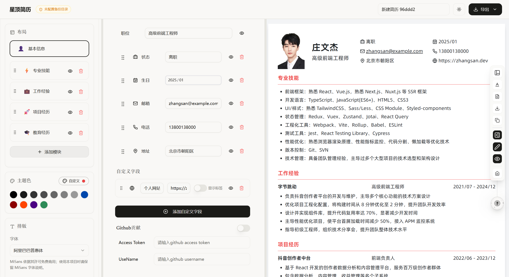

<div align="center">

# ✨ 星顶简历 ✨

简体中文 | [English](./README.en.md) | **[🚀 在线体验](https://cv.sonnet.skin)**

</div>



星顶简历（ZoneYottaZenith）是一款现代化的在线简历编辑器，让创建专业简历变得简单有趣。基于 TanStack Start 和 Framer Motion 构建，支持实时预览、自定义主题，并深度适配移动端体验。

## ✨ 特性

- 🚀 基于 TanStack Start + React 18 构建
- 💫 流畅的动画效果（Framer Motion）
- 🎨 多套简历模板 + 自定义主题
- 📱 移动端深度优化（紧凑排版、底部导航、工具面板）
- 🌙 深色 / 浅色模式自由切换
- 📤 导出为 PDF / 打印 / JSON / Markdown
- 🔄 实时预览（拖拽、内联编辑）
- 💾 自动保存到本地（localStorage）
- 🔒 数据安全，无需注册，无需上传服务器
- 📊 累计使用人次实时展示
- 🔍 简历分析跳转入口
- 💼 数据备份导出 / 从 JSON 一键还原
- 🤖 AI 辅助编写、语法检查、内容润色
- 🌐 多语言支持（中文 / English）
- 📂 桌面端同步目录配置

## 🛠️ 技术栈

| 分类 | 技术 |
|------|------|
| 框架 | TanStack Start, React 18, TypeScript |
| 动画 | Framer Motion |
| 样式 | Tailwind CSS, Shadcn/ui |
| 状态 | Zustand |
| 编辑器 | Tiptap（富文本） |
| 图标 | Lucide Icons |
| 包管理 | pnpm |

## 🚀 快速开始

**1. 克隆项目**

```bash
git clone <your-repo-url>
cd magic-resume-main
```

**2. 安装依赖**

```bash
pnpm install
```

**3. 启动开发服务器**

```bash
pnpm dev
```

**4. 打开浏览器访问** `http://localhost:3000`

## 📦 构建打包

```bash
pnpm build
```

## 🐳 Docker 部署

### Docker Compose（推荐）

确保已安装 Docker 和 Docker Compose，在项目根目录运行：

```bash
docker compose up -d
```

这将会：

- 自动构建应用镜像
- 在后台启动容器
- 将 `./data` 目录挂载到容器内，**持久化使用计数（重启不丢失）**

### 说明

- 默认端口：`3000`
- 使用计数数据存储于 `./data/usage.json`（宿主机持久化）
- 无需外部数据库，开箱即用

